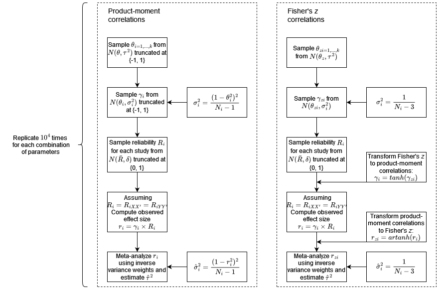

```{r setup, include=FALSE}
knitr::opts_chunk$set(echo = TRUE)
```


# Methods

All code and data for this project are available at (OSF LINK). For our simulations and analyses we used R (REF) and we used the R package 'metafor' (REF) to perform meta-analyses and estimate heterogeneity, For parallel computing we took advantage of the R packages 'parallel' (REF) and 'parabar' (REF). 

## Simulation study design

Figure 1 provides an overview of the design of this simulation study. Our design was broadly the same for product-moment correlations and Fisher's $z$, with some minor differences we highlight in the text below detailing the procedure.

```{r Figure 1, echo=FALSE, out.width= "100%"}

```

(FIGURE 1: a flowchart summarizing the simulation design)

When generating data for meta-analysis we proceeded as follows. First,  we sampled $i = 1, ..., k$ true study effect sizes $\theta_i$ from $Ntrunc(\theta, \tau^2)$. That is, a normal distribution with a mean of $\theta$ and a variance of $\tau^2$ that we truncated at $\{-1, 1\}$ to stay within the bounds of the product-moment correlation. For Fisher' $z$ no truncation was applied.

Practically, we implemented the truncation as follows. First, we sampled $k$ probabilities from an uniform distribution $U(a, b)$ where $a$ and $b$ are the values given by the cumulative distribution function (CDF) of the normal distribution $N(\theta, \tau^2)$ at $\{-1, 1\}$. Second, we then back-transformed the $k$ sampled values onto the $N(\theta, \tau^2)$ distribution using the inverse of the CDF. 

For each of the $k$ sampled true study effect sizes $\theta_i$ we then sampled one observed effect size $\gamma_i$ from a truncated normal distribution $Ntrunc(\theta_i, \sigma_i^2)$, using the same truncation procedure. The sampling variance $\sigma_i^2$ for each true effect size $\theta_i$ we computed using the standard formula for Pearson's $r$ $\sigma_i^2 =  \frac{(1 - \theta_i^2)^2}{N_i - 1}$ where $N_i$ is the total sample size for study $i = 1, ..., k$. For Fisher's $z$ no truncation was applied and we approximated the sampling variance as $\sigma^2_i = \frac{1}{N_i - 3}$. At this point we have $k$ sampled effect sizes $\gamma_i$ in Pearson's $r$ or Fisher's $z$ without measurement error. 

To add measurement error we first sampled a reliability $R_i$ for each study from a truncated ($\{0, 1\}$) normal distribution $Ntrunc(\bar{R}, \delta)$, given some average reliability across studies $\bar{R}$ and standard deviation in reliability $\delta$. We assumed that both the dependent and independent variable within a study were measured with the same reliability such that $R_i = R_{iXX'} = R_{iYY'}$. We then computed observed effect sizes $r_i$ for each study given the attenuation formula $r_{i} = \gamma_i \times \sqrt{R_{XX'}} \times \sqrt{R_{YY'}}$. Because we assumed equal reliability in $X$ and $Y$ this simplifies to $r_i = \gamma_i \times R_i$.   Fisher's $z$ we transformed to product-moment correlations before adding measurement error and then back-transformed into Fisher's $z$ before the next step. At this point we have $k$ effect sizes $r_i$ in Pearson's $r$ or Fisher's $z$ with sampling error and measurement error, ready for meta-analysis.

We meta-analyzed the $k$ effect sizes using a random effects model with inverse variance weights and the Restricted Maximum Likelihood (REML) estimator of heterogeneity. We choose the REML estimator because it is a heterogeneity estimator that performs well and is widely implemented (e.g., REF, REF2), but also show our results using the classic DerSimonian-Laird (DL) estimator in supplement X. Similarly, inverse variance weights are widely used, perform similarly to other common weights (e.g., REF1 REF2) and we see no reason other implementations would change our results substantially. The procedure described in this section was replicated 10,000 times for each combination of parameter values.

## Parameter values

We vary the grand mean $\theta$ from 0 to 0.6 in steps of 0.1 to cover all realistic effect sizes and explore the boundaries of the the interaction between effect size and reliability variance. For Fisher's $z$ we transformed these value into equivalent effect sizes at the Fisher's $z$ scale. To put these values into context we turn to the empirical estimates of typical correlational effect sizes provided by Nuijten et al., (REF) and Schäfer & Scharz (REF). Nuijten et al. performed a meta-meta-analysis on the fields of RESEARCH and reports a median meta-analytic effect size of 0.24 for predictive validity and correlational studies. This estimate is likely positively biased due to publication bias and selective reporting. Schäfer & Scharz report a median $r$ of 0.16 amongst preregistered research in FIELD, with an 'upper median' (i.e., the 83.35% quantile) of 0.41. This estimate is likely less affected by positive bias but should not be expected to be unbiased (REF Scheel). 

We defined the between-studies variance ($\tau^2$) to cover a wide range of variance in true effect sizes and empirical estimates reported in the psychological literature. Van Erp et al., (REF) provide empirical heterogeneity estimates from a large number of meta-analyses. The median Pearson's $r$ $\tau^2$ value in these data 
was 0.03 (interquartile range 0.01 - 0.0576). As the point of this study is that empirical heterogeneity estimates may not be accurately estimated we selected a range of $\tau^2$ estimates for the product-moment that we considered reasonable and that also covered most of the empirical estimates from van Erp et al. These were {0, ..., VALUES}.

Fisher's z is measured at a different scale and it is not possible to directly convert $\tau^2$-values expressed in Pearson's $r$ into corresponding $\tau^2$-values on the Fisher's $z$ scale. To be able to compare results between Fisher's $z$ and the product-moment correlation we defined heterogeneity on the $I^2$ scale. The $I^2$ index is a relative measure of heterogeneity describing the percentage of total variance that is due to heterogeneity (REF Higgins), an as such is measured from 0 - 100%. The $I^2$ index can be defined as $I^2 = \frac{\tau^2}{s^2 + \tau^2}$ where $s^2 = \frac{\Sigma w_i(k - 1)}{(\Sigma w_i)^2 - \Sigma w_i^2}$ and $w_i$ is the precision $w_i = 1 / \sigma^2$. This means that its value generally depends on both the number of studies $K$ and the sample size $N_i$ in these studies (REF: Higgins, I2 is not an absolute measure of heterogeneity). However, because we keep $N_i$ fixed across studies (see below), the value of $I^2$ depends only on $N = N_i$ and the heterogeneity. We thus compute the $I^2$ index for each sample size condition and $\tau^2$-values defined in Pearson's $r$, and then compute corresponding $\tau^2$-values on the Fisher's $z$ scale given these $I^2$-values and sample sizes.

We ran our analyses across a range of sample sizes $N$ and number of studies $K$. Within meta-analyses we used a fixed sample size across all studies such that $N = N_i$. We made this choice rather than treating sample size as a random variable to be able to observe the effect of changes in sample size on estimates, and because we are focused on the average heterogeneity estimates rather than its sampling variance. We base our range of sample sizes on empirical estimates of typical sample size in correlational research in psychology by XXX (still needs lookup) and consider the following values {VALUES}. 

When focusing on the bias of heterogeneity estimate, the value of $K$ would not matter for an unbiased estimator. However, both the heterogeneity estimator we use, restricted maximum likelihood, and most other heterogeneity estimators are truncated at zero (REF Viechtbauer). Lower values for $K$ then results in a larger proportion of truncated estimates below zero because of increased sampling variance. As such, the values of $K$ can affect bias, especially at lower levels of heterogeneity. In their review of meta-analyses in psychology, van Erp et al. (YEAR) find $K$ values ranging from XX to XX, and in our simulations we consider the following values {VALUES}.

Finally, we defined average reliability levels and their standard deviation based on empirical estimates from the literature. Flake et al. (YEAR) report that based on 245 estimates of Cronbach's alpha in psychology the average estimate was 0.79 with a standard deviation of 0.13. The interquartile range was approximately 0.68 - 0.87 for studies wherein the associated scale lacked a reference and 0.79 - 0.88 for scales that did have a reference. Sanchez-Meca et al. (REF) report the reliability estimates based on five 'reliability generalization studies'. These five studies summarized reliability in 25 - 51 primary studies (184 total), and the mean reliability ranged from 0.767 to 0.891 with standard deviations ranging between 0.034 - 0.133. Given some likely positive bias in such empirical values, we examined the following mean reliabilities $\{0.6, 0.7, 0.8, 0.9\}$, and standard deviations $\{0, 0.05, 0.1, 0.15\}$. 
