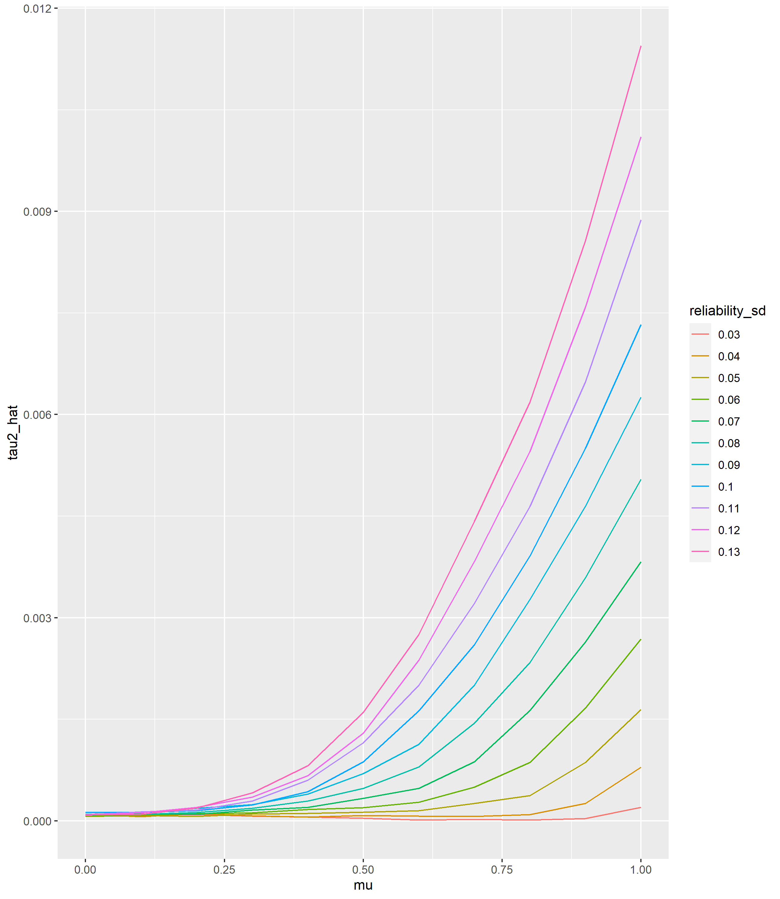
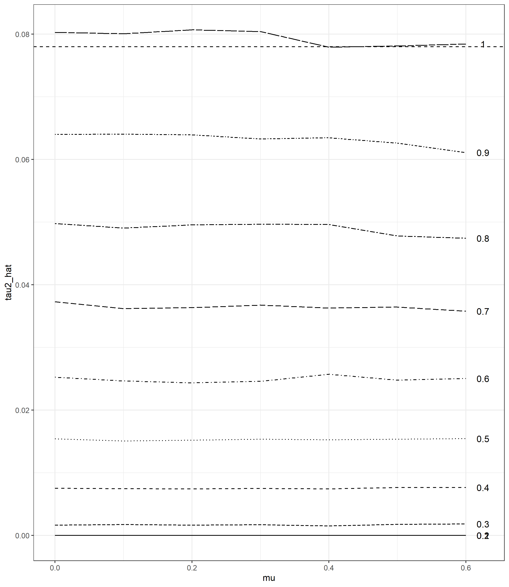
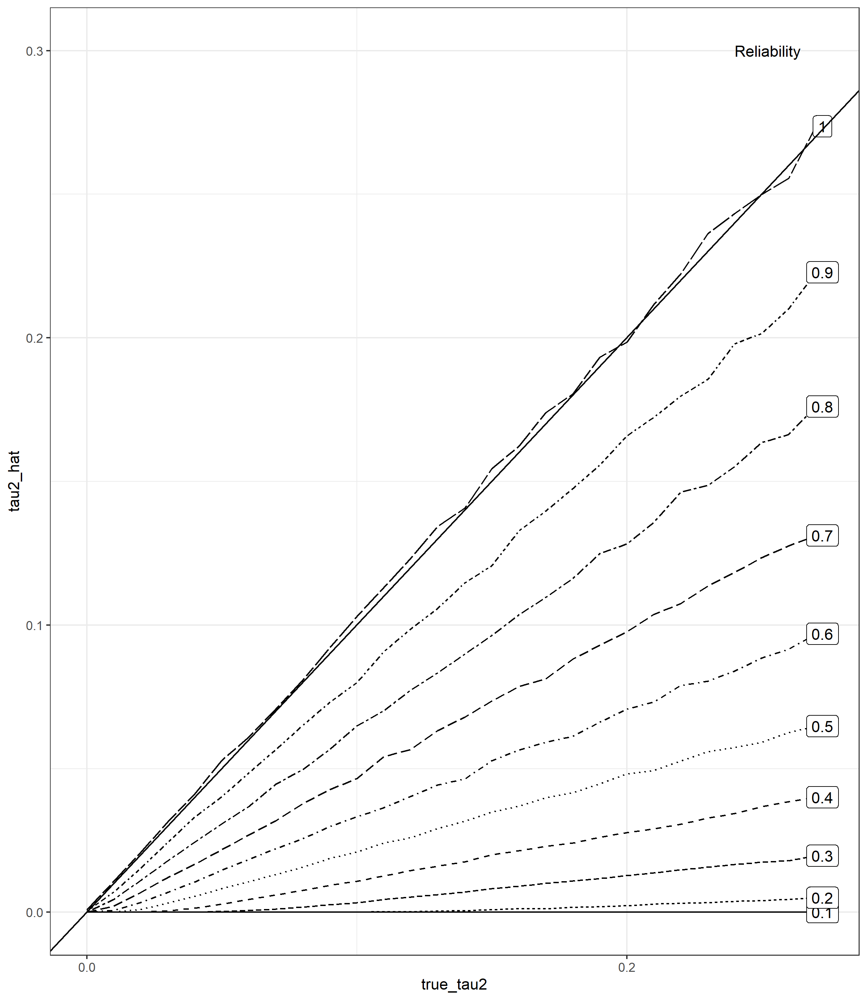

```{r setup, include=FALSE}
knitr::opts_chunk$set(echo = FALSE, fig.width = 6, fig.asp = 0.75)
```

In Olsson-Collentine et al., (2019) we demonstrate that variation in reliability between the studies included in a meta-analysis will lead to an overestimate of statistical heterogeneity. This point is also made by Hunter and Schmidt (year) whose claims are repeated in a recent paper published by Perspectives on Psychological Science (REF). However, in this article we demonstrate that this overestimate only holds in the absence of true heterogeneity (i.e., under a fixed effect meta-analytic framework). In the presence of true heterogeneity, imperfect reliability in the studies instead leads to an underestimate of the true heterogeneity.

## Method and results
Troughout this article we use sample size = 150 participants in all studies, and k = 20 studies in each meta-analysis. For simplicity we also use Pearson's correlations for the simulations. In Figure 1 we demonstrate the overrestimate that might be expected in the absence of true heterogeneity, across a range a empirical reliability estimates from Flake et al., (2017) and Sanchez-Meca et al (YEAR). Both reported an average alpha close to .8 and with an SD of .13 (Flake et al) or that ranged up to .13 (Sanche-Meca et al.). In Figure 1, we draw reliabilities for the K studies from a normal distribution centered on 0.8 and with varying SDs.


```{r plot1}

```


In the presence of true heterogeneity, we underestimate it when study reliabilities are imperfect. The effect of sample size is minimal. We demonstrate this relationship for tau2 = 0.078, which corresponds to and I2 of 95% given our sample size, number of studies and effect size type. We show this across a range of empirically relevant effect sizes based on Schäfer & Schwarz (2019), with the upper limit corresponding to the 'upper median' (83.35% quantile) of non-preregistered effect sizes in their study.

```{r plot2}

```

As the true heterogeneity increases, the underestimate due to imperfect reliability of included studies becomes worse in an absolute sense. Nonetheless, as Figure 3 demonstrates, this relationship is linear and the proportional underestimate stays stable regardless of true heterogeneity. Figure 2 demonstrated that effect size largely does not matter for the underestimate of heterogeneity due to imperfect reliabilities; here we have used an average effect size (r = 0.24) corresponding to the median found amongst correlational intelligence studies by Nuijten et al. (YEAR).

```{r plot3}

```


Finally, figure 4 demonstrates that even under conditions generous to the overrestimate due to varying reliability (i.e., large effect size and large variance in reliabilities) the overrestimate due to these factors is not able to compensate for the underrestimate of heterogeneity due to imperfect reliability. In sum, imperfect reliability in studies included in meta-analysis will tend to lead to an underestimate of true heterogeneity. Nonetheless, this underestimate is quite small under realistic conditions and is unlikely to be of large concern.
